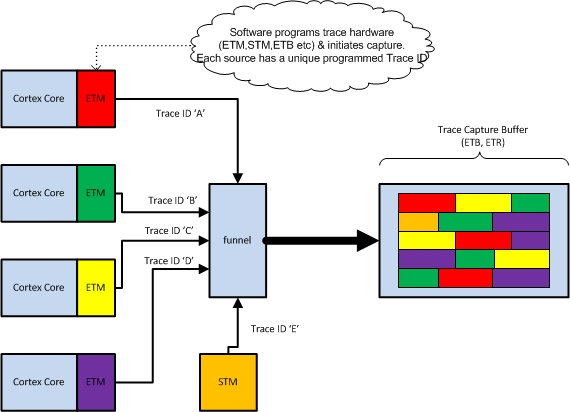
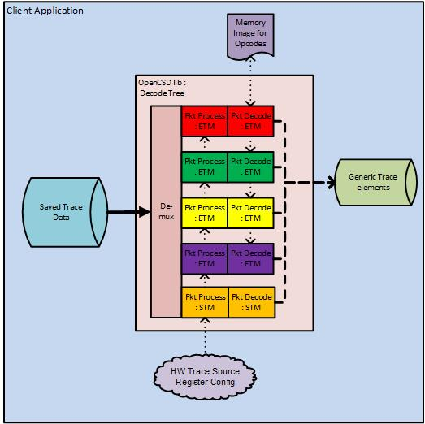
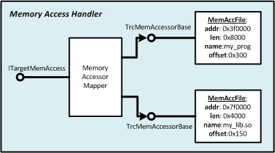
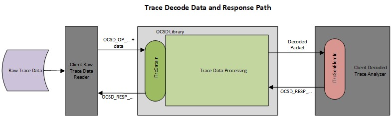

OpenCSD Library - Programmers Guide    {#prog_guide}	
===================================

@brief  A guide to programming the OpenCSD library.

Introduction and review of Coresight Hardware 
---------------------------------------------

The OpenCSD trace decode library is designed to allow programmers to decode ARM CoreSight trace
data. This guide will describe the various stages of configuring and programming a decoder instance 
for a given CoreSight system.

The diagram below shows a typical Coresight trace hardware arrangement

The design shown has four Cortex cores, each with an ETM, along with a system STM all of which generate trace into the
trace funnel. The output of the funnel is fed into a trace sink, which might be an ETB or ETR, saving the trace
which is multiplexed into CoreSight trace frames in the trace sink memory. The colours represent the sources 
of trace data, each of which will be tagged with a CoreSight Trace ID.

### CoreSight Trace ID ###
The CoreSight Trace ID - also referred to as the Trace Source Channel ID - is a unique 8 bit number programmed
into each trace source in a system (ETM,PTM,STM) which identifies the source to both the hardware components 
downstream and the software trace decoders. This ID is used 

Overview of Configuration and Decode
------------------------------------

The OpenCSD library will take the trace data from the trace sink, and when correctly configured and programmed, will
demultiplex and decode each of the trace sources.

The library supports ETMV3, PTM, ETMv4 and STM trace protocols. The decode occurs in three stages:
- __Demultiplex__ - the combined trace streams in CoreSight trace frame format are split into their constituent streams according to the CoreSight trace ID.
- __Packet Processing__ - the individual trace ID streams are resolved into discrete trace packets.
- __Packet Decode__ - the trace packets are interpreted to produce a decoded representation of instructions executed.

There are input configuration requirements for each stage of the decode process - these allow the decode process to correctly 
interpret the incoming byte stream.
- __Demultiplex__ - Input flags are set to indicate if the frames are 16 byte aligned or if the stream contains alignment 
bytes between frames.
- __Packet Processing__ - The hardware configuration of the trace source must be provided. This consists of a sub-set of the
hardware register values for the source.  Each protocol has differing requirements, represented by an input structure of the 
register values.
- __Packet Decode__ - For ETM/PTM packet decode, this stage requires the memory images of the code executed in order 
to determine the path through the code. These are provided either as memory dumps, or as links to binary code files.

_Note_ : STM, being a largely software generated data trace, does not require memory images to recover the data written by the source
processors.

The diagram below shows the basic stages of decode for the library when used in a client application:

The DecodeTree object is a representation of the structure of the CoreSight hardware, but in reverse in that the data is pushed into the 
tree, through the demultiplexor and then along the individual trace stream decode paths till the output decode packets are produced.

These outpup packets are referred to as Generic Trace packets, and are at this stage protocol independent. They consist primarily of
PE context information and address ranges representing the instructions processed.

### Decode Tree ###

The DecodeTree is the principal wrapper for all the decoders the library supports. This provides a programming 
API which allows the creation of protocol packet processors and decoders. 

The API allows the client application to configure the de-multiplexor, create and connect packet processors and 
packet decoders to the trace data streams and collect the output generic decoded trace packets. The DecodeTree 
provides a built in instruction decoder to allow correct trace decode, and an additional API through a memory 
access handler to allow the client applications to provide the images of the traced code in file or memory dump  
format. 

Once a DecodeTree is configured, then it can be re-used for multiple sets of captured trace data where the same
set of applications has been traced, or by changing only the supplied memory images, different traced applications
on the same hardware configuration.

The process for programming a decode tree for a specific set of trace hardware is as follows;-
1. Create the decode tree and specify the de-multiplexor options.
2. For each trace protocol of interest, use the API to create a decoder, providing the hardware configuration, 
including the CoreSight trace ID for that trace stream. Specify packet processing only, or full decode. Client
program must know the correct protocol to use for each trace stream.
3. Attach callback(s) to receive the decoded generic trace output (ITrcGenElemIn).
4. Provide the memory images if using full decode.

The DecodeTree can now be used to process the trace data by pushing the captured trace data through the trace
 data input API call (ITrcDataIn) and analyzing as required the resulting decoded trace (ITrcGenElemIn).
 
 The objects and connections used for a single trace stream are shown below.
 
 
 
 All these components can be created and used outside of a DecodeTree, but that is beyond the scope of this
 guide and expected to be used for custom implementations only.

Programming Examples - decoder configuration.
---------------------------------------------

The remainder of this programming guide will provide programming exceprts for each of the required stages
to get a working decode tree, capable of processing trace data.

The guide will be based on an ETMv4 system, similar to the example above, using the C++ interface, but 
equivalent calls from the C-API wrapper library will also be provided.

The source code for the two test applications `trc_pkt_lister` and `c_api_pkt_print_test` may be used as 
further programming guidance.

### Create the decode tree ###

The first step is to create the decode tree. Key choices here are the flags defining expected trace data
input format and de-mux operations.

~~~{.cpp}
	uint32_t formatterCfgFlags = OCSD_DFRMTR_FRAME_MEM_ALIGN; /* basic operational mode for on-chip captured trace */
	DecodeTree *pTree = DecodeTree::CreateDecodeTree(OCSD_TRC_SRC_FRAME_FORMATTED, formatterCfgFlags);
~~~

This creates a decode tree that is usable in the majority of cases - that is for trace captured in on chip
RAM via ETB or ETR. Additional flags are available if a TPIU is used that will indicate to the frame de-mux
that additional frame synchronisation data is present.

In limited cases where the hardware has a single trace source, or only a single source is being used, then
it is possible to switch off the hardware frame formatter in the ETB/ETR/TPIU. In this case @ref OCSD_TRC_SRC_SINGLE
 (from enum @ref ocsd_dcd_tree_src_t) may be defined as the first parameter to the function.
 
C-API version of above code:
~~~{.c}
	dcd_tree_handle_t dcdtree_handle = ocsd_create_dcd_tree(OCSD_TRC_SRC_FRAME_FORMATTED, OCSD_DFRMTR_FRAME_MEM_ALIGN);
~~~

### Error loggers and printers ###

The library defines a standard error logging interface ITraceErrorLog which many of the key components can register 
with to output errors. The process of registering the source means that errors can be tied to a particular component, 
or CoreSight Trace ID. The library provides a standard error logger object - ocsdDefaultErrorLogger - which 
keeps a copy of the last error logged, plus a copy of the last error logged for each data stream associated 
with a CoreSight trace ID. 

The error logger can be attached to an output logger - ocsdMsgLogger - which can print text versions of the
error, or other error messages, out to screen or logging file. Errors can be filtered according to a severity rating,
defined by @ref ocsd_err_severity_t.

The DecodeTree will use a default error logger from the library - with a message logger
that will output to `stderr`. Client applications can adjust the configuration of this error logger and 
message logger, or provide their own configured error logger / message logger pair. 

The test program `trc_pkt_lister` provides a customised version of an `ocsdMsgLogger` / `ocsdDefaultErrorLogger` pair
to ensure that messages and errors are logged to the screen and a file of its choice. This logger is eventually
passed through to the decode tree.

Code excerpts below (trc_pkt_lister.cpp):

~~~{.cpp}
	static ocsdMsgLogger logger;
	static int logOpts = ocsdMsgLogger::OUT_STDOUT | ocsdMsgLogger::OUT_FILE;
	static std::string logfileName = "trc_pkt_lister.ppl";
	
	// ** other vars
	
	main() {
		
		// ** some init code
	
	    logger.setLogOpts(logOpts);
		logger.setLogFileName(logfileName.c_str());	

		ocsdDefaultErrorLogger err_log;
		err_log.initErrorLogger(OCSD_ERR_SEV_INFO);
		err_log.setOutputLogger(&logger);
		
		// pass err_log reference into snapshot library code
		SnapShotReader ss_reader;
		ss_reader.setErrorLogger(&err_log);
		
		// ** rest of program 
	}
~~~
	
In the library code for the snapshot reader (ss_to_dcd_tree.cpp):

~~~{.cpp}	
	bool CreateDcdTreeFromSnapShot::createDecodeTree()
	{
		// ** create a decode tree
		
	    // use our error logger - don't use the tree default.
        m_pDecodeTree->setAlternateErrorLogger(m_pErrLogInterface);
	}
	
~~~

__Note__:  The Snapshot reader library is test code designed to allow the test application read trace snapshots 
which are in the form defined by the open specification in `./decoder/docs/specs/ARM Trace and Debug Snapshot file format 0v2.pdf`

This format is used in ARM's DS-5 debugger, and the open source CoreSight Access Library (CSAL).

### Configuring decoders ###

The next task is to configure the requried decoders. The client program must know the type of ETM/PTM in use
to correctly set the decoder configuration.

Each class of trace source has a specific set of register values that the decoder requires to correctly interpret the 
raw trace data and convert it to packets then fully decode.

Configuration of an ETMv4 decoder requires initialisation of the EtmV4Config class, which is achieved by filling in a 
@ref ocsd_etmv4_cfg structure:-

~~~{.c}
	typedef struct _ocsd_etmv4_cfg 
	{
		uint32_t                reg_idr0;    /**< ID0 register */
		uint32_t                reg_idr1;    /**< ID1 register */
		uint32_t                reg_idr2;    /**< ID2 register */
		uint32_t                reg_idr8;
		uint32_t                reg_idr9;   
		uint32_t                reg_idr10;
		uint32_t                reg_idr11;
		uint32_t                reg_idr12;
		uint32_t                reg_idr13;
		uint32_t                reg_configr;  /**< Config Register */
		uint32_t                reg_traceidr;  /**< Trace Stream ID register */
		ocsd_arch_version_t    arch_ver;   /**< Architecture version */
		ocsd_core_profile_t    core_prof;  /**< Core Profile */
	} ocsd_etmv4_cfg;
~~~

The structure contains a number of read-only ID registers, and key programmable control registers that define
the trace output features - such as if the ETM will output timestamps or cycle counts - and the CoreSight Trace ID.

Once this structure is filled in then the decoder can be configured in the decode tree:-

~~~{.cpp}
	ocsd_etmv4_cfg config;
	
	// ...
	// code to fill in config from programmed registers and id registers
	// ...
	
	EtmV4Config configObj(&config);		// initialise decoder config class 
	std::string decoderName(OCSD_BUILTIN_DCD_ETMV4I);  // use built in ETMv4 instruction decoder.
	int decoderCreateFlags = OCSD_CREATE_FLG_FULL_DECODER; // decoder type to create - OCSD_CREATE_FLG_PACKET_PROC for packet processor only
	ocsd_err_t err = pDecodeTree->createDecoder(decoderName, decoderCreateFlags,&configObj);
~~~

This code creates a full trace decoder for an ETMv4 source, which consists of a packet processor and packet decoder pair. The decoder is automatically associated with the 
CoreSight Trace ID programmed into the register provided in the `config` structure. 

It is also possible to create a packet processor only decoder if the `OCSD_CREATE_FLG_PACKET_PROC` flag is 
used instead. These packet only decoders can be used to create a dump of the raw trace as discrete trace packets.

All decoders a registered with the library using a name - the standard ARM protocols are considered built in
decoders and are registered automatically. The library contains defined names for these decoders - `OCSD_BUILTIN_DCD_ETMV4I`
 being the name used for ETMv4 protocol.

The C-API uses the call create_generic_decoder() with the same configuration structure:-

~~~{.c}
	ocsd_etmv4_cfg config;
	
	// ...
	// code to fill in config from programmed registers and id registers
	// ...
	
	const char * decoderName = OCSD_BUILTIN_DCD_ETMV4I);  // use built in ETMv4 instruction decoder.
	int decoderCreateFlags = OCSD_CREATE_FLG_FULL_DECODER; // decoder type to create - OCSD_CREATE_FLG_PACKET_PROC for packet processor only
	void *p_context =  // <some_client_context>
	ocsd_err_t err = create_generic_decoder(dcdtree_handle,decoderName,(void *)&config,p_context);	
~~~

The configuration must be completed for each trace source in the decode tree which requires decoding.

The different trace source types have different configuration structures, classes and names

| protocol  | config struct       |  class      |  name define                 | 
|:----------|:--------------------|:------------|:-----------------------------|
| __ETMv4__ | @ref ocsd_etmv4_cfg | EtmV4Config | @ref OCSD_BUILTIN_DCD_ETMV4I |
| __ETMv3__ | @ref ocsd_etmv3_cfg | EtmV3Config | @ref OCSD_BUILTIN_DCD_ETMV3  |
| __PTM__   | @ref ocsd_ptm_cfg   | PtmConfig   | @ref OCSD_BUILTIN_DCD_PTM    |
| __STM__   | @ref ocsd_stm_cfg   | STMConfig   | @ref OCSD_BUILTIN_DCD_STM    |

### Adding in Memory Images ###

Memory images are needed when a full trace decode is required. Memory images consist of a base address and length, and 
contain instruction opcodes that may be executed during the operation of the traced program. The images are used by 
the decoder to follow the path of the traced program by interpreting the information contained within the trace that 
defines which program branches are taken and the target addresses of those branches.

The library defined memory image accessor objects, which can be simple memory buffers, files containing the binary
code image, or a callback that allows the client to handle memory accesses directly. When files are used, the 
 object may contain a set of base addresses and lengths, with offsets into the file - allowing the decoder 
 to directly access multiple code segments in executable image files.

Memory image objects are collated by a memory mapper. This interfaces to the decoder through the ITargetMemAccess interface,
and selects the correct image object for the address requested by the decoder. The memory mapper will also validate image 
objects as they are added to the decoder, and will not permit overlapping images. 

The client can add memory images to the decoder via API calls to the decode tree. These methods add memory image accessors of various
types to be managed by a memory access mapper:-

~~~{.cpp}
	class DecodeTree {
		///...
		ocsd_err_t addBufferMemAcc(const ocsd_vaddr_t address, const ocsd_mem_space_acc_t mem_space, const uint8_t *p_mem_buffer, const uint32_t mem_length);
		ocsd_err_t addBinFileMemAcc(const ocsd_vaddr_t address, const ocsd_mem_space_acc_t mem_space, const std::string &filepath);
		ocsd_err_t addBinFileRegionMemAcc(const ocsd_file_mem_region_t *region_array, const int num_regions, const ocsd_mem_space_acc_t mem_space, const std::string &filepath);     */
		ocsd_err_t addCallbackMemAcc(const ocsd_vaddr_t st_address, const ocsd_vaddr_t en_address, const ocsd_mem_space_acc_t mem_space, Fn_MemAcc_CB p_cb_func, const void *p_context); 
		///...
	}	
~~~

It is further possible to differentiate between memory image access objects by the memory space for which they are valid. If it is known that a certain code image 
is present in secure EL3, then an image can be associated with the @ref ocsd_mem_space_acc_t type value @ref OCSD_MEM_SPACE_EL3, which will allow another image to be 
present at the same address but a different exception level.  However, for the majority of systems, such detailed knowledge of the code is not available, or 
overlaps across memory spaces do not occur. In these cases, and for general use (including Linux trace decode),  @ref OCSD_MEM_SPACE_ANY should be used.

The C-API contains a similar set of calls to set up memory access objects:-

~~~{.c}
	OCSD_C_API ocsd_err_t ocsd_dt_add_buffer_mem_acc(const dcd_tree_handle_t handle, const ocsd_vaddr_t address, const ocsd_mem_space_acc_t mem_space, const uint8_t *p_mem_buffer, const uint32_t mem_length); 
	OCSD_C_API ocsd_err_t ocsd_dt_add_binfile_mem_acc(const dcd_tree_handle_t handle, const ocsd_vaddr_t address, const ocsd_mem_space_acc_t mem_space, const char *filepath); 
	OCSD_C_API ocsd_err_t ocsd_dt_add_binfile_region_mem_acc(const dcd_tree_handle_t handle, const ocsd_file_mem_region_t *region_array, const int num_regions, const ocsd_mem_space_acc_t mem_space, const char *filepath); 
	OCSD_C_API ocsd_err_t ocsd_dt_add_callback_mem_acc(const dcd_tree_handle_t handle, const ocsd_vaddr_t st_address, const ocsd_vaddr_t en_address, const ocsd_mem_space_acc_t mem_space, Fn_MemAcc_CB p_cb_func, const void *p_context); 
~~~

### Adding the output callbacks ###

The decoded trace output ia collect by the client application through callback functions registered with the library.

Depending on the decode configuration chosen, this can be in the form of the fully decoded trace output as generic trace
packets, or discrete trace packets for each trace stream ID.

__Full Decode__

When full decode is chosen then all output is via the generic packet interface:

~~~{.cpp}
	class ITrcGenElemIn
	{
		///...
		
		virtual ocsd_datapath_resp_t TraceElemIn(const ocsd_trc_index_t index_sop,
                                              const uint8_t trc_chan_id,
                                              const OcsdTraceElement &el);
    }
~~~

The client application registers a callback class or function with this signature. 

For each output packet the libary calls the registered function,  providing the byte index into the raw trace for the first 
byte of the trace protocol packet that resulted in its generation, plus the CoreSight trace ID of the source stream, 
#and the output packet itself.

The client callback must process the packet before returning the call - the reference to the packet data is only 
valid for the duration of the call. This means that the client will either have to copy and buffer packets for later
processing if required, process immediately, or use an appropriate combination, dependent on the requirements of the
client.

The client callback provides a ocsd_datapath_resp_t response code to indicate to the input side of the library if decoding is to continue.

~~~{.cpp}
	DecodeTree *pTree;
	TrcGenericElementPrinter genElemPrinter; // derived from ITrcGenElemIn, overrides TraceElemIn() to print incoming packet to logger.
	
	///...
	
	pTree->setGenTraceElemOutI(genElemPrinter);
	
~~~

Alternatively in C-API, the callback function pointer type is defined:-

~~~{.c}
	typedef ocsd_datapath_resp_t (* FnTraceElemIn)( const void *p_context, 
													const ocsd_trc_index_t index_sop, 
													const uint8_t trc_chan_id, 
													const ocsd_generic_trace_elem *elem); 	
~~~

giving API calls to set up:-

~~~{.c}
	FnTraceElemIn gen_pkt_fn = &gen_trace_elem_analyze; // set to function matching signature.
	dcd_tree_handle_t dcdtree_handle;
	
	// ...
	
	ret = ocsd_dt_set_gen_elem_outfn(dcdtree_handle, gen_pkt_fn, 0);
~~~

The output packets and their intepretatation are described here [prog_guide_generic_pkts.md](@ref generic_pkts).

__Packet Process only, or Monitor packets in Full Decode__

The client can set up the library for packet processing only, in which case the library output is 
the trace packets only, so these packets need a sink callback for each channel being output.

When full decode is in operation, then the principle output is the generic packets that are output for
all channels in operation to the single callback mentioned above. Additional callbacks can be added to 
each of the trace channels to monitor the packet processing stage as it happens at point that the packets 
are passed to the full decoder.

Both methods of processing the discrete trace packets require callbacks to be registered on a 
per Trace ID / channel basis. The specifics of the callback and the resulting packet will vary according to 
the protocol of the trace source.

The .cpp interface registers a packet sink / packet monitor object with the relevant decoder object. 

This sink object is based on the tempated IPktDataIn interface.

~~~{.cpp}
template<class P> class IPktDataIn : public ITrcTypedBase {
	// ...
	    virtual ocsd_datapath_resp_t PacketDataIn( const ocsd_datapath_op_t op,
                                                const ocsd_trc_index_t index_sop,
                                                const P *p_packet_in) = 0;
}
~~~

The template type parameter will be the protocol type for the trace source in question - e.g. EtmV4ITrcPacket.
This interface contains a method that will be called with trace packets. 

The monitor object must be based on the IPktRawDataMon class, with a similarly typed template parameter and callback
function. 

~~~{.cpp}
template<class P> class IPktRawDataMon : public ITrcTypedBase {
	// ...
	    virtual void RawPacketDataMon( const ocsd_datapath_op_t op,
                                   const ocsd_trc_index_t index_sop,
                                   const P *pkt,
                                   const uint32_t size,
                                   const uint8_t *p_data) = 0;
}
~~~

Given a suitable callback object the process for attaching to the decode is as follows:-

~~~{.cpp}
	// client custom packet sink for ETMv4 - derived from IPktDataIn 
	class MyTracePacketSinkETMv4 : public IPktDataIn<EtmV4ITrcPacket> {
		// ...
	};

	uint8_t CSID;	
	DecodeTree *pTree;	// pointer to decode tree
    MyTracePacketSinkETMv4 *pSink;     
 
	// ... obtain CSID and decode tree object
 
	// decode trees manage decode elements using a tree element object, registered against CSID.
    DecodeTreeElement *pElement = pTree->getDecoderElement(CSID);
	pSink = new MyTracePacketSinkETMv4();
	if (pElement && pSink)
		err = pElement->getDecoderMngr()->attachPktSink(pElement->getDecoderHandle(), pSink);
            
~~~

The decode tree object is used to obtain the decode tree element associated with the Coresight trace ID. 
The IDecoderMngr interface on this object is used to attach the packet sink object to the required decoder.

For monitor objects use an attachPktMonitor() call with a suitably derived monitor sink object.

The key difference between the packet sink, and the packet monitor is that the monitor is not in the trace decode 
data path, so does not return ocsd_datapath_resp_t values. The monitor callback also provides the raw trace byte 
data for the packet.

Device tree call for registering a callback in C-API and the function signatures for each type of shown below..
The C-API code contains underlying managment code that connects the callback with the correct packet decoder object.

~~~{.c}
OCSD_C_API ocsd_err_t ocsd_dt_attach_packet_callback(  const dcd_tree_handle_t handle,    // decode tree handle
                                                const unsigned char CSID,				  // trace channel ID
                                                const ocsd_c_api_cb_types callback_type,  // defines packet only processing sink or monitor function signature.
                                                void *p_fn_callback_data,                 // pointer to the callback function for the packet data.
                                                const void *p_context);				      // opaque context to use inside the callback.
~~~

Callback definition for packet only sink callback type:
~~~{.c}
/** function pointer type for packet processor packet output sink, packet analyser/decoder input - generic declaration */
typedef ocsd_datapath_resp_t (* FnDefPktDataIn)(const void *p_context, 
                                                const ocsd_datapath_op_t op, 
                                                const ocsd_trc_index_t index_sop, 
                                                const void *p_packet_in
												);
~~~

Callback  definition for packet monitor callback type
~~~{.c}
/** function pointer type for packet processor packet monitor sink, raw packet monitor / display input - generic declaration */
typedef void (* FnDefPktDataMon)(const void *p_context,
                                 const ocsd_datapath_op_t op,
                                 const ocsd_trc_index_t index_sop,
                                 const void *p_packet_in,
                                 const uint32_t size,
                                 const uint8_t *p_data
								 );
~~~

As with the `.cpp` code, the monitor callback does not have a return value, but also has the raw trace bytes for the packet as part of
the monitor.

In both cases in the C-API, the `void *p_packet_in` must be cast to packet structure appropriate to the trace protocol associated with the 
CSID value. e.g. for ETMv4 this would be @ref ocsd_etmv4_i_pkt. 

Programming Examples - using the configured Decode Tree.
--------------------------------------------------------
 
Once the decode tree has been configured then data raw trace data can be processed through the decode tree.

The client program will require two functions to use the library. The first is on the input side of the library 
which must be driven with raw data, until the data is complete, or an error occurs. This processing routine must 
check the library returns and respond appropriately.

The second consists of output callback(s) which process the decoded generic packets, or trace packets. 
This routine will return response codes according to the needs of the client.

 
The diagram shows the data input and response path. The data is driven into the decoding library by the client raw data input 
routine on the left. Processed packets are received by the client packet callback(s) on the right, and push response codes back
through the library.

The raw data input routine calls the standard ITrcDataIn interface with an operation code, and if appropriate some raw 
trace data. The input operation code will define how the library treats the input parameters.

| Operation          | Description                                                      | Trace Data provided |
|:-------------------|:-----------------------------------------------------------------|:--------------------|
| @ref OCSD_OP_DATA  | Process data provided by data pointer parameters.                | Yes                 |
| @ref OCSD_OP_FLUSH | Call after prior wait response - finish processing previous data | No                  |
| @ref OCSD_OP_EOT   | End of trace data. Library will complete any pending decode.     | No                  |
| @ref OCSD_OP_RESET | Hard reset of decoder state - use current config for new data    | No                  |

A set of standard responses is used to indicate to the raw data input whether it should continue to push data through the library, 
pause and then flush, or if a fatal processing error has occurred. 

The response codes can come from the internal library decoder, or from the part of the client that is handling the processing of the 
output packets on the right of the diagram. 

_Response Codes_: The are contained in the @ref _ocsd_datapath_resp_t enum.

- __OCSD_RESP_CONT, OCSD_RESP_CONT_xxx__: 	Indicates that processing is to continue. Generated either internally by the library if more data 
										is needed to generate an output packet, or by the output packet processors to indicate processing 
										is to continue.
- __OCSD_RESP_WAIT, OCSD_RESP_WAIT_xxx:__   Sent by the client processors to pause processing. This will freeze the internal state of the library
									    and cause the WAIT response to be propogated through to the input side, with an indication of the number
									    of bytes processed. After a WAIT, the input side must respond with flush operations, until a CONT is 
										seen again and further data can then be input into the library.
- __OCSR_RESP_FATAL_xxx__:                  Fatal processing error. No further processing can take place. See error response logger for reason.
                                        Normally the result of corrupt or incorrect trace data.

The user should note that the client program controls routines on both the input and output side of the library. The output routine may be buffering 
output packets, and when the buffer is full, returns a WAIT ressponse. This will be propgated through to the input routine. This should now terminate
data processing, saving state and the client will run a routine to empty / process the full packet buffer. Once the necessary processing is done, 
then the input routine can be restarted, but __must__ follow the FLUSH operational rule described above.

Excerpts from the data input routine used by the `trc_pkt_lister` program are shown below:

~~~{.cpp}
                   // process the current buffer load until buffer done, or fatal error occurs
                    while((nBuffProcessed < nBuffRead) && !OCSD_DATA_RESP_IS_FATAL(dataPathResp))
                    {
                        if(OCSD_DATA_RESP_IS_CONT(dataPathResp))
                        {
                            dataPathResp = dcd_tree->TraceDataIn(
                                OCSD_OP_DATA,
                                trace_index,
                                (uint32_t)(nBuffRead - nBuffProcessed),
                                &(trace_buffer[0])+nBuffProcessed,
                                &nUsedThisTime);

                            nBuffProcessed += nUsedThisTime;
                            trace_index += nUsedThisTime;

                        }
                        else // last response was _WAIT
                        {
                            // may need to acknowledge a wait from the gen elem printer
                            if(genElemPrinter->needAckWait())
                                genElemPrinter->ackWait();

                            // dataPathResp not continue or fatal so must be wait...
                            dataPathResp = dcd_tree->TraceDataIn(OCSD_OP_FLUSH,0,0,0,0);
                        }
                    }
					
~~~

_Note_: in this test program, the WAIT response is an artificial test condition, so the input routine does not terminate on seeing it - it is cleared down
and FLUSH is immediately sent. Normal client routines would most likely drop out of the processing loop, take actions to clear the WAIT condition, then
resume processing with a FLUSH.

See the `trc_pkt_lister` and `c_api_pkt_print_test` test program source code for further examples of driving data through the library.
